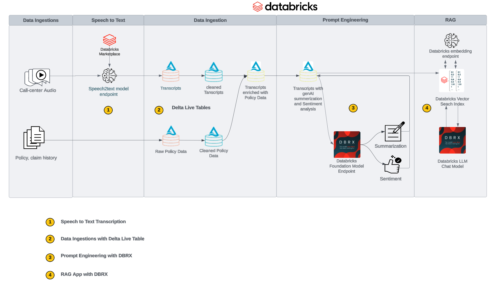

# Application: Extract Intelligence from raw call center transcripts using RAG

## Architecture

## Please Follow the Steps Below:

### Introduction and Setup Environment

  * Use the notebook **`config`** to define the name of your preferred catalog, schema, and volume
  * Then review notebook **`Introduction`** for an overview of the current PoC Template
  * Run notebook **`00-setup`** to create a catalog, schema, volume, and download dataset to the volume

