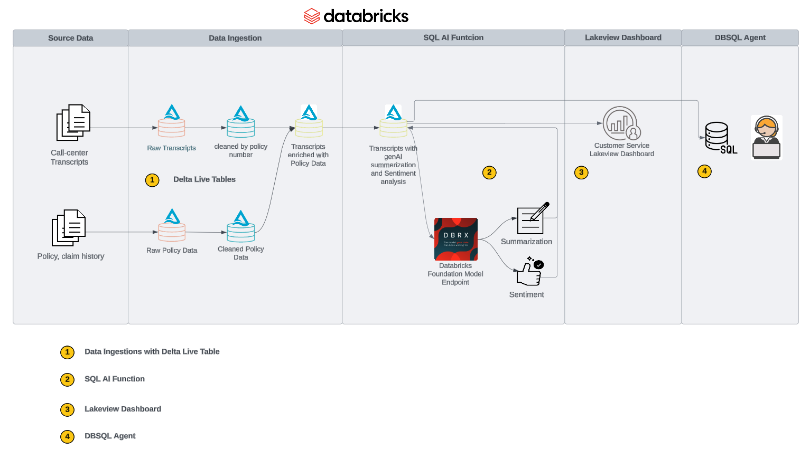
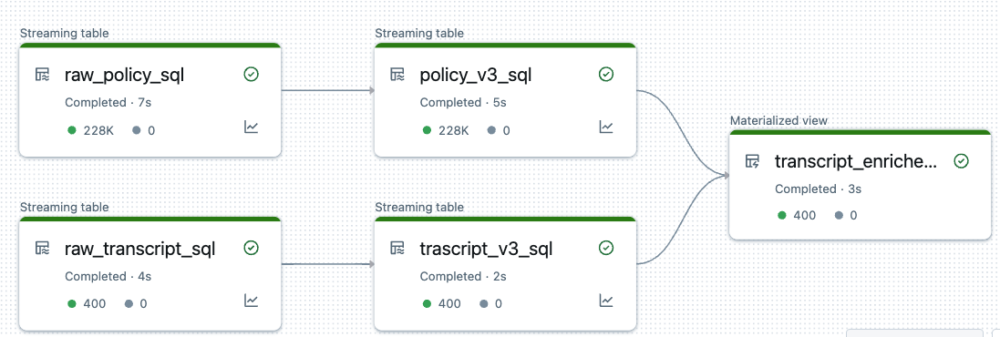
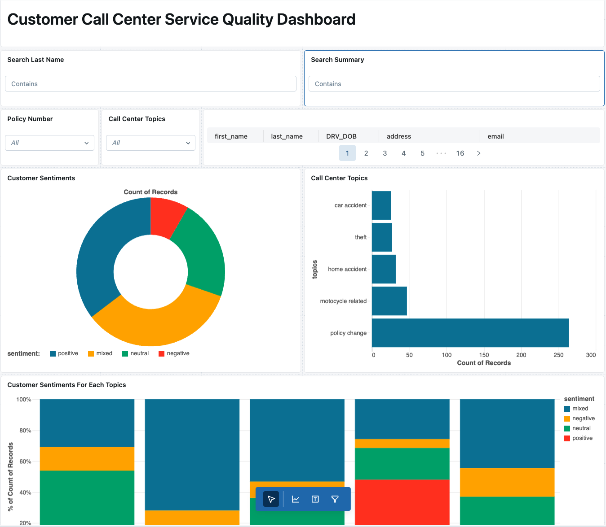

# Application: Extract Intelligence from raw call center transcripts using RAG

## Architecture

## Please Follow the Steps Below:

### Introduction and Setup Environment

  * Use the notebook **`config`** to define the name of your preferred catalog, schema, and volume
  * Then review notebook **`Introduction`** for an overview of the current PoC Template
  * Run notebook **`00-setup`** to create a catalog, schema, volume, and download dataset to the volume

### Step 1. Data Ingestions with Delta Live Table

  * Create a Delta Live Table Pipeline using notebook **`01-DLT-Transcript-Policy`**, refer to the below imange for the example of the resulting pipeline. Please also refer to the [DLT pipeline tutorial](https://learn.microsoft.com/en-us/azure/databricks/delta-live-tables/tutorial-pipelines) on how to set up a DLT pipeline
  
  * Run notebook **`01.1-DLT-Transcript-Enriched-Persist-MV`** to create a copy of materialized view of the DLT from the previous step. This steps is needed to due the current [limitation](../../README.md#limitations) of DLT table

### Step 2. Perform LLM Summarization, Sentiment Analysis and Classification with [Databricks SQL AI Fundations](https://docs.databricks.com/en/large-language-models/ai-functions.html)

* Run notebook **`02-GenAI-Text-Classification`** to perform summarization and sentiment analysis task using prompt enginering in batch with the Databricks DBRX foundation model
* We can create Lakehouse Dashboard based on the analysises performed by the AI functions.
  

  * Here is the [example lakeview dashboard template](./customer_service_quality_dashboard.lvdash.json). To import the dashboard template to your workspace, please refer to [this script](../../scripts/dashboard_utils.py)

### Step 3. Using DBSQL Agent to ask question on the data 

* Run notebook **`03-LLM-SQL-Agent`** to ask questions on the analysis result table from applying AI Functions.
* DBSQL agent is based on [Langchain agent](https://python.langchain.com/v0.1/docs/use_cases/sql/agents/) and [SQL Database toolkits](https://python.langchain.com/v0.2/docs/integrations/toolkits/sql_database/)