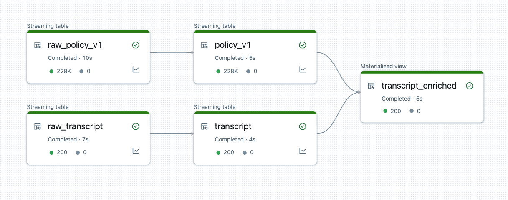

# Application: Extract Intelligence from raw call center transcripts using RAG

## Architecture

## Please Follow the Steps Below:

### Introduction and Setup Environment

  * Use the notebook **`config`** to define the name of your preferred catalog, schema, and volume
  * Then review notebook **`Introduction`** for an overview of the current PoC Template
  * Run notebook **`00-setup`** to create a catalog, schema, volume, and download dataset to the volume

### Step 1. Data Ingestions with Delta Live Table

  * Create a Delta Live Table Pipeline using notebook **`01-DLT-Transcript-Policy`**, refer to the below imange for the example of the resulting pipeline. Please also refer to the [DLT pipeline tutorial](https://learn.microsoft.com/en-us/azure/databricks/delta-live-tables/tutorial-pipelines) on how to set up a DLT pipeline
  
  * Run notebook **`01.1-DLT-Transcript-Enriched-Persist-MV`** to create a copy of materialized view of the DLT from the previous step. This steps is needed to due the current [limitation](../../README.md#limitations) of DLT table

### Step 2. Prompte Engineering with Databricks DBRX Fundation LLM

* Run notebook **`02-Prompt-Engineering`** to perform summarization and sentiment analysis task using prompt enginering in batch with the Databricks DBRX foundation model

### Step 3. RAG Chatbot with Databricks DBRX Fundation LLM

* Run notebook **`03-Knowledge-Chatbot-RAG`** to create a vector search index using the result delta table of the previous notebook **`03-Prompt-Engineering`**, we then build a RAG Chatbot with the Databricks DBRX foundation model using the vector search index as context. Lastly, we deploy the chat model to Databricks Model Serving Endpoint using Mosaic agent framework which creates a review app for the expert review process