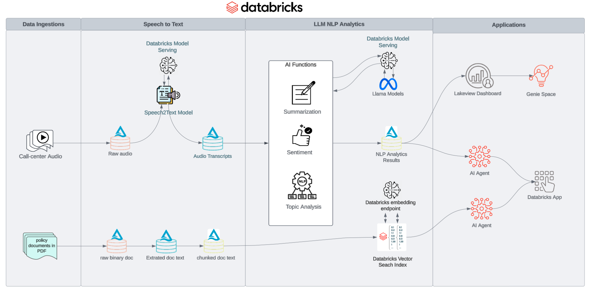

# Industry Use Case: Insurance Call Center Operation Automation with AI Agents 

## Architecture

In this PoC accelerator, we will demonstrate how to build an multi-agent AI system to automate the 
operation of an insurance call center. The system will be able to perform the following tasks:

* Transcribe call center audio recordings using Databricks Batch Inference and AI Functions
* NLP analysis of call center call transcripts using Databricks Batch Inference and AI Functions
* Create a vector search knowledge base from insurance policy documents in PDF
* Authoring AI Agents with Databricks UC function tools and Agent Frameworking using LangGraph 
* Create a databricks APP with AI Agents to perform Insurance Call Center Operation Automation

## Steps