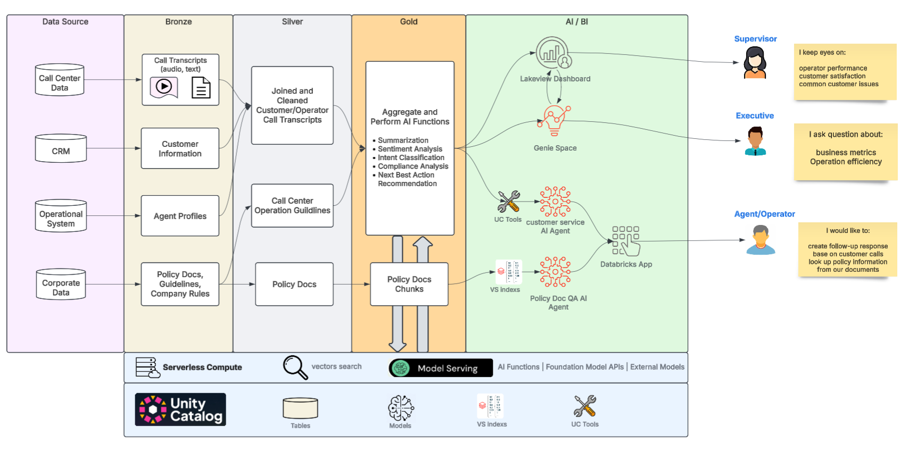
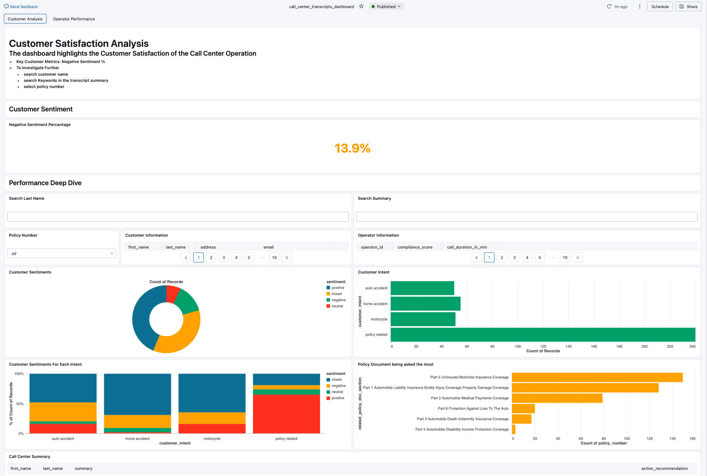
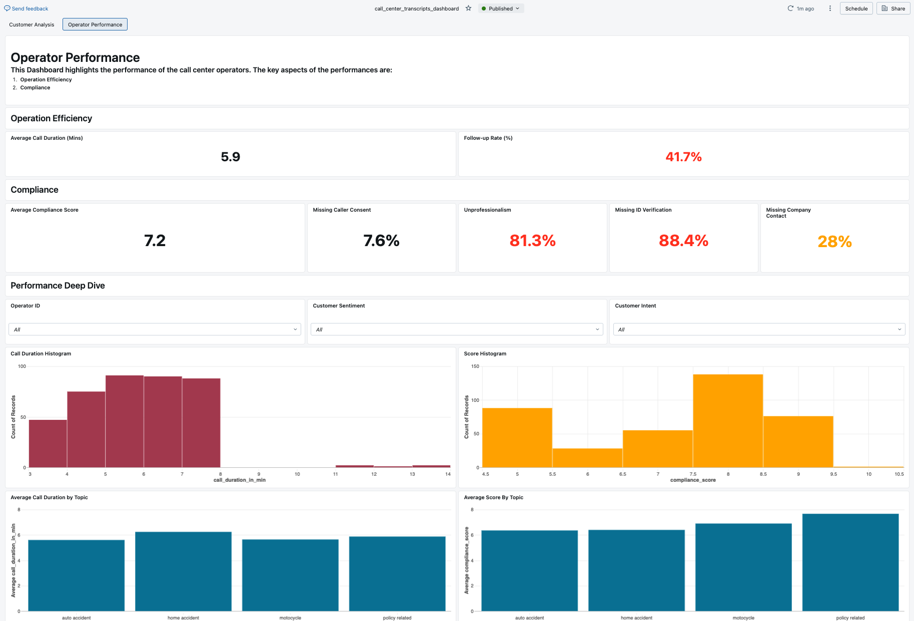
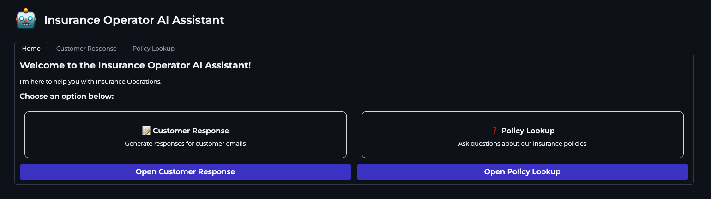
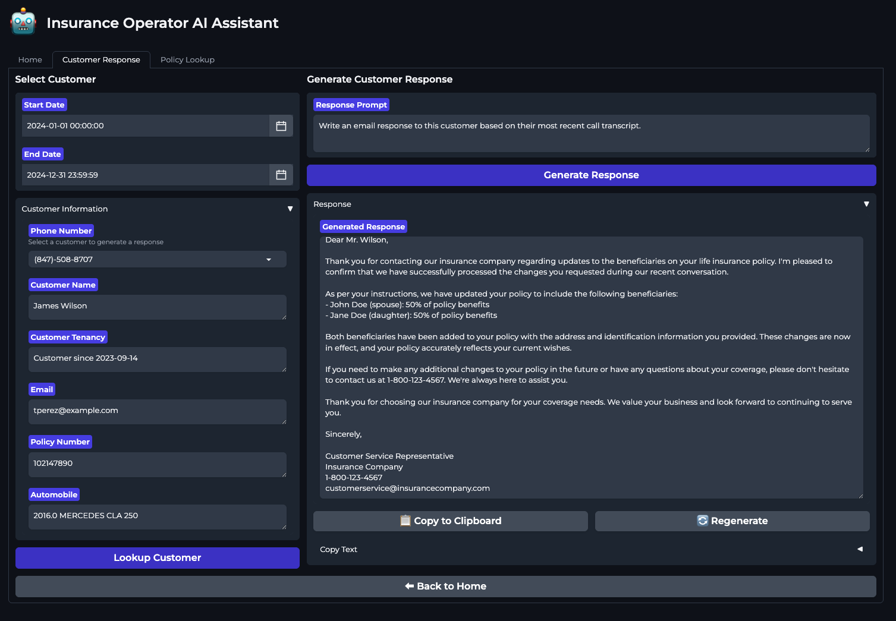
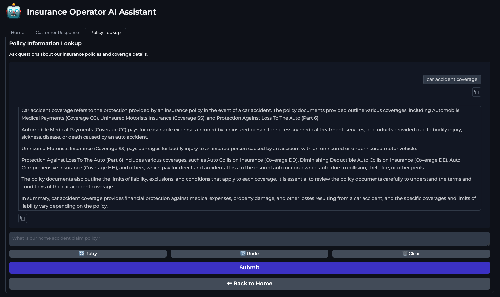

# Industry Use Case: Insurance Call Center Operation Automation with AI Agents 

## Architecture

In this PoC accelerator, we will demonstrate how to build an multi-agent AI system to automate the 
operation of an insurance call center. The system will be able to perform the following tasks:

* Transcribe call center audio recordings to text using OpenAI Whisper large v3 (Optional)
* Ingestion raw transcripts, perform cleaning, and NLP analysis using Databricks Batch Inference and AI Functions with DLT
* Create a vector search knowledge base from insurance policy documents in PDF
* Prepare data for AI/BI dashboards
* Create AI/BI dashboard for customer satisfaction analysis and operational efficiency analysis
* Create a genie space from AI/BI dashboard.
* Authoring AI Agents with Databricks UC function tools and Agent Frameworking using LangGraph 
* Create a databricks APP with AI Agents to perform Insurance Call Center Operation Automation

## Instruction

1. Start with 00-setup notebook to setup the data source
2. Run the notebook following the order of the notebook names.
3. One can import the dashboard json file but may require addition adjustments to the dashboard.

## Dashboard

### Customer Satisfaction Analysis Tab

### Customer Satisfaction Analysis Tab

## Databricks App

### Front Page

### Customer Service Agent

### Policy QA Agent

